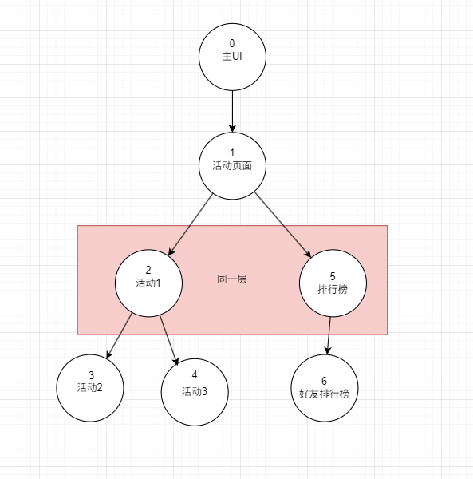

# UI框架

1. # UI 框架

    1. ## 非侵入式设计：

        1. 不侵入任何工作流，不需要为使用该UI框架培养新习惯。
        2. 学习成本轻量，且使用符合人类直觉。
    2. ## 纯代码管理：

        1. 提供代码控制UI层级的权限，可由纯代码完成UI开发流程，灵活度高。
    3. ## 分组式管理：

        1. 不以通常的层级作为UI的层级划分，而是采用代码友好的分组式划分。
    4. ## 热更新支持：

        1. 内置资源加载器，可从AB包或Resources中读取需要的资源。
2. # UI框架设计图

    1. 总体设计：

        
    2. 各层次完成的任务：

        1. 基础层：提供通用的轮子。
        2. 资源层：提供内存管理，资源加载管理，代码生成等基本工具，以及提供UI框架的基本元素。
        3. 逻辑层：对外包装UI框架使用接口，对内提供UI数据流。
        4. 表现层：使用逻辑层的UI数据流完成层级控制，性能优化等功能。
    3. UI框架总数据流图：

        
    4. UI层级管理数据流图：

        
3. # UI 框架核心功能

    1. ## 核心思路

        1. ### 前序树维护UI层级结构：

            1. 当前环境：

                1. 使用栈和层级无法跟踪复杂的UI关系。

                    1. 当需求中临时要求时，若还需保持原有层级逻辑，要么去临时修改层级，要么去更改需求。

                        1. 比如需求打开背包面板 + 装备面板，或者背包面板 + 商店面板。一般来说，这些特定面板都属于系统层，是互相屏蔽的。这时有这么个打开两个同层UI的需求，若按栈和层级管理，就只能添加临时层。临时层会大大增加维护的难度。
                    2. 比如当打开两个同层UI时，再先后打开这两个UI的子UI，可发现它们在栈中的关系已经错乱。即本应该在面板1上的子UI跑到了面板2上。
            2. 解决方案：

                1. 使用树结构完成UI管理。

                    1. 可行性讨论：

                        1. 首先分析栈和层级管理的目的：

                            1. 追踪UI的显示逻辑：UI的显示次序遵循先进后出原则，符合栈结构。利用该栈结构可轻松追踪UI的先后次序，以控制渲染先后顺序。
                            2. 方便同层屏蔽：可通过栈的出栈查询到当前UI的上一层级元素。若做同层屏蔽，则只需要将小于或等于当前层级的元素全部出栈即可。
                            3. 父子关系追踪：可利用程序中函数栈的思想，子元素就是父元素的子栈。
                            4. 方便性能优化：利用栈存储UI的先后次序，可做如遮挡屏蔽等性能优化。
                        2. 树结构如何实现以上目的：

                            1. 使用前序树跟踪UI元素的显示逻辑。

                                1. UI显示逻辑跟踪：

                                    1. 当一个系统UI显示时：

                                        

                                        前序号越大的UI，越后打开，渲染顺序越靠前。
                                    2. 当两个以上系统UI显示时：

                                        

                                        同样按前序号管理。
                                2. 同层屏蔽：

                                    1. 由于考虑到以上问题，且不想引入临时层级，因此采用分组管理方法。

                                        
                                3. 父子状态跟踪:

                                    1. 只需要在子节点处记录父节点的前序号即可。
                                4. 方便性能优化：

                                    1. 遮挡屏蔽：依赖于前序号，可在插入元素后，刷新前序号时屏蔽序号小于当前元素且可被当前元素遮挡的元素。
                                    2. 面向代码的动静分离优化：可在代码中控制UI元素的分组，因此可由代码控制动态元素和静态元素的不同分组。
            3. 优势：

                1. 对比栈 + 层级管理，前序树可更加优雅地管理UI元素，且能接受更高复杂度的管理。
                2. 分组管理下，性能优化的上限更高，程序可方便地直接用代码控制动静分离。
            4. 劣势：

                1. 对Unity的UI层级支持不够。
                2. 完全依赖于代码。
                3. 只是简化UI的层级管理逻辑，对制作UI的支持不足。
                4. 若对UGUI源码了解不足，有可能在使用该框架时遇到性能下降的情况。如无脑使用动态Canvas只为显示寥寥几个按钮，就会因为GraphicsRaycast的增多而导致EvenSystem的性能下降。
        2. ### 虚拟Canvas统一UI元素渲染顺序：

            1. 当前环境：

                1. 由于采用了分组设计，如何根据前序号确定当前UI在当前组的渲染顺序，以及组与组间的渲染顺序？
            2. 解决方法：

                1. 首先分析是什么影响了UI的渲染顺序：

                    1. 不同Canvas间，SortOrder越大的越优先显示。
                    2. 同Canvas内，越深层的元素越优先显示。
                2. 构建虚拟Canvas：

                    1. 同组的UI会被分配到同一个Canvas下，但它们会持有各自独立的虚拟Canvas。

                        1. 前序号会更改虚拟Canvas的sort Order，由虚拟Canvas根据sortOder管理该元素在真实Canvas下的层次关系。
                    2. 不同组的UI会分配独立的Canvas，

                        1. 前序号会更改虚拟Canvas的sort Order，虚拟Canvas直接更改真实Canvas的sort order。
            3. 作用：

                1. 向层级管理器屏蔽分组管理的细节，让其只需根据UI的显示次序更改前序号，即可自动设置渲染顺序。
            4. 具体实现：

                1. 根据该元素配置，为它选择不同的虚拟Canvas分配方式：

                    1. 静态：会将该UI元素分配到静态Canvas下管理，静态Canvas全局唯一。
                    2. 动态：会为该UI元素分配独立Canvas，
                    3. 分组：会为该UI元素分配组Canvas,组Canvas的sortOrder由创建该组的UI元素的前序号决定。
                2. 虚拟Canvas屏蔽sortOrder

                    1. 根据虚拟Canvas的类型对sortOrder更改做不同策略。

                        1. 静态 || 分组 ： 修改同组UI元素的VC等于修改该元素所在组Canvas下的层级次序。
                        2. 动态：修改该元素的VC即修改独立Canvas的sortording
    2. ## 状态管理

        1. 实现原理：

            1. 在UIManager中留存已经打开了的UI元素数据，当代码中再次要求Show时，检查该元素是否有记录，即可得知它是否打开。
    3. ## 父子状态追踪

        1. 实现原理:

            1. 在树中跟踪父子关系，只需要将该节点的全部子节点取出即可。
        2. 可以打开UI元素的接口有两个：

            1. 直接从UIManager调用Show:默认会将UI元素的父节点定为0号，也就是主UI的父节点。
            2. 使用UIController的ShowSubUI:会将子UI元素的父节点定为当前节点。
        3. 开启父子状态追踪后：

            1. 一旦父节点被遮挡，子节点也会被视为遮挡。
            2. 一旦父节点被销毁，子节点也会被销毁。
    4. ## 遮挡销毁

        1. 实现原理：

            1. 预算UI面板的最大Rect : 在UI元素的初始化阶段计算出该UI元素最大占屏幕的范围。
            2. 前序更新回调：在为新UI更新前序号时，前序号小于新UI的元素会被加入检查，若该元素的最大Rect是否被新元素完全覆盖，则屏蔽该元素。
    5. ## 层级屏蔽

        1. 实现原理：

            1. 获取同层元素：根据VC指明的真实Canvas即可获取所有同层元素。销毁它们再加入新元素即可。
    6. ## 焦点夺取

        1. 实现原理：

            1. 前序更新回调：在为新UI更新前序号时，前序号小于新UI的元素会被直接屏蔽。
    7. ## UI分组

        1. 实现原理：

            1. 分组索引：使用[字典树](计算机体系/数据结构与算法/数据结构/树结构/字典树.md)存储不同分组的虚拟Canvas。
4. # 非核心部分：

    1. ## 资源加载：

        1. 当前问题：需要从不同的文件夹读取出不同格式的资源。
        2. 作用：向上屏蔽不同路径加载资源问题。
        3. 实现思路：

            1. 在不同的层级加入不同功能的处理中间层
            2. 设计图：
            3. 

                UIManager获取资源全流程：

                
    2. ## 内存管理：

        1. 当前问题：UI频繁加载与卸载会对GC与性能造成很大影响。
        2. ### UI池：

            1. 作用：

                1. 向上屏蔽UI对象的内存管理。
                2. 控制UI元素的GC。
                3. 指引UI资源的装卸。
            2. 设计图：

                1. 
            3. 当前问题：

                1. #### 当一部分UI元素处于长期不使用状态，如何甄别它们并且销毁？
                2. UI池销毁策略：

                    1. 原理：灵感来自LRU，删除池中最近不常用的部分，留下常用的。
                    2. 思路：

                        1. 定时记录池数量：使用定时器定时触发记录事件，事件会记录当前元素池的数量到缓存队列中。
                        2. 统计最大变更量：当缓存队列满，将队列中的记录值全部出队，计算记录间的最大差值。
                        3. 移除已稳定的数量：当前池数量 - 最大差值 即是已经稳定的部分，将该部分删除即可。
                    3. 代码实现：
                    4. ```c#
                        		 private Queue<int> recentCounts = new Queue<int>();
                                /// <summary>
                                /// 最近数量记录次数，当对应次数的记录中池中的数目都相差不大于1，则说明池中资源已经稳定，可以进行回收
                                /// </summary>
                                /// 
                                public int MaxRecentCount = 3;
                                /// <summary>
                                /// 算出最近池的最大差值，清除掉差值外的稳定资源
                                /// </summary>
                                private void ClearPool()
                                {
                                    if (isCached)
                                    {
                                        recentCounts.Enqueue(pool.Count);
                                        if (recentCounts.Count >= MaxRecentCount)
                                        {
                                            int maxDelta = 0;
                                            for (int i = 0; i < recentCounts.Count - 1; i++)
                                            {
                                                int delta = Mathf.Abs(recentCounts.Dequeue() - recentCounts.Peek());
                                                maxDelta = Mathf.Max(maxDelta, delta);
                                            }
                                            Destroy(maxDelta);
                                        }
                                    }
                                }
                                public void Destroy(int rest)
                                {
                                    lock (pool)
                                    {
                                        while (pool.Count > rest)
                                            GameObject.Destroy(pool.Pop());
                                    }
                                }
                        ```
                    5. 好处：

                        1. 能尽可能的删除不再需要的部分，保留可能会被再次使用的部分。
                    6. 待优化：

                        1. 还没有测试出最合理的缓存队列大小以及定时器的循环区间。
5. # 进阶功能实现

    1. ## 静态遮罩优化

        1. ### 剖析 Mask 和 Mask2D 的性能痛点

            1. Mask2D:

                1. 遮罩原理：收集当前可被遮罩元素的父节点的所有 Mask2D 矩阵，求出最大交集（共和矩阵）。将该矩阵传入遮罩 shader 中，shader 的行为是对当前元素的每个像素点做判断，若该像素在共和矩阵内则渲染，否则将该像素设置为透明。

                    1. [可被遮罩元素](UGUI源码.md#20250424175020-5c9f4c7)：实现了 IClipper 的对象，如 Image 等都是。当触发如 OnEnable 等条件时，就将自己注册进 ClipperRegister，并进行遮挡剔除。[详情](UGUI源码.md#20250412200028-10vxg5r)
                2. 优势：DrawCall 的次数只与能被显示的像素矩阵个数有关。如同一个元素，但被遮罩切分成四分，就会导致四个 DrawCall。因为有四份共和矩阵需要传入 shader 做判断。
                3. 劣势：共和矩阵的计算过程会导致 CPU 耗时增加。
            2. Mask：

                1. 遮罩原理：通过在材质上做模板测试，将元素中不通过测试的像素点置为透明。
                2. 优势：由于使用的遮罩材质一致，因此父遮罩可以进行合批。且子元素参与遮挡剔除时并不需要额外数据（即父遮罩的共和矩阵），因此子元素的渲染不会打断合批，子元素也可合批。
                3. 劣势：

                    1. 当出现子元素先后关系时会打断合批，合批无效化。
                    2. 父遮罩会频繁设置材质脏，即父遮罩会产生 DrawCall。
            3. 总结：

                1. Mask2D 的优势是一个显示一个 DrawCall，适用于遮罩元素较少且本身材质就不一致的情况。
                2. Mask 适用于遮罩元素多且可合批。
        2. ### 有没有两者的兼容模式？

            1. 实现的效果：既能节省共和矩阵的计算，又能保证子元素可合批。
            2. 实现思路：提前计算好共和矩阵缓存起来，且使用 Mask 进行遮罩。当子元素没有元素在共和矩阵内时，将该子元素设为非活。

                1. 建立 MaskManager 树：

                    1. 树节点：每一个树节点有且仅有一个 Mask，节点内管理着当前 Mask 所影响范围内的所有元素。
                    2. 节点次序：每个 MM 都遵循在层级面板中的层级结构。
                    3. 实现：（因为是针对面板中的元素，因此与 UI 框架其他部分无关，可以 LateUpdate）

                        1. 进入 MaskManager 树后，先检查当前 Mask 的真实矩阵有没有发生变化，如果发生变化则重新计算以当前 MM 节点往下的所有结点的共和矩阵(层次执行，还是先执行后面的元素求交，等遍历到哪个 MM 节点，哪个才计算)。然后将受当前 Mask 影响的所有元素遍历，与当前的共和矩阵求交，若有交集则设活，若无交集则设死。
                2. 共和矩阵计算：

                    1. 在初始化阶段就将共和矩阵计算出来，逐层求交，逐层注册遮罩元素。最后统一管理。
                3. 跟踪 Mask 的变动：

                    1. 每帧依据 Mask 树逐层检测 Mask 是否产生变动，若存在一个 Mask 的 Rect 和 Pos 发生变动，则重新计算整棵树的共和矩阵。
                4. 检测子物体的位置：

                    1. 每帧检测子物体的矩形和共和矩形是否有交集，有交集则设活。没交集则直接设死。
            3. 缺陷：

                1. 无法直接获取到子元素移动的事件，只能通过每帧检查完成，可能影响性能。
    2. ## 字典树进阶优化

        1. 字典树当前劣势：
        2. 优化思路：
    3. ## HUD的纯shader实现

        1. 如何为大量实体提供高性能的HUD？
    4. ## 异步支持

        1. 如何结合UniTask为UI框架提供异步支持？
    5. ### 模块化的配置主导UI框架

        1. 比如活动页面，如何通过读取配置的形式灵活配置？
    6. ## 3D UI支持

        1. 3D UI如何实现遮挡销毁？

            1. 如何确认矩阵的相互遮挡关系？
    7. ## MVVM高性能实现

        1. 如何构建成熟MVVM框架，而不只是构建可绑定器。

            1. 源生成器学习。

‍
