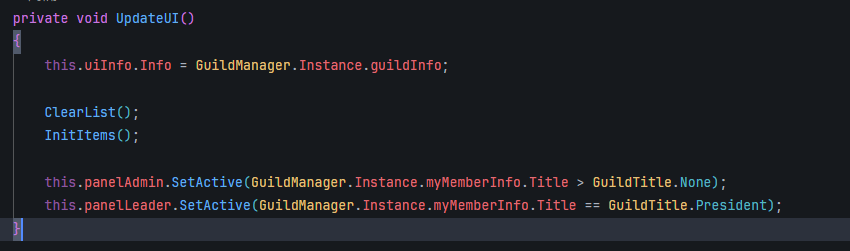
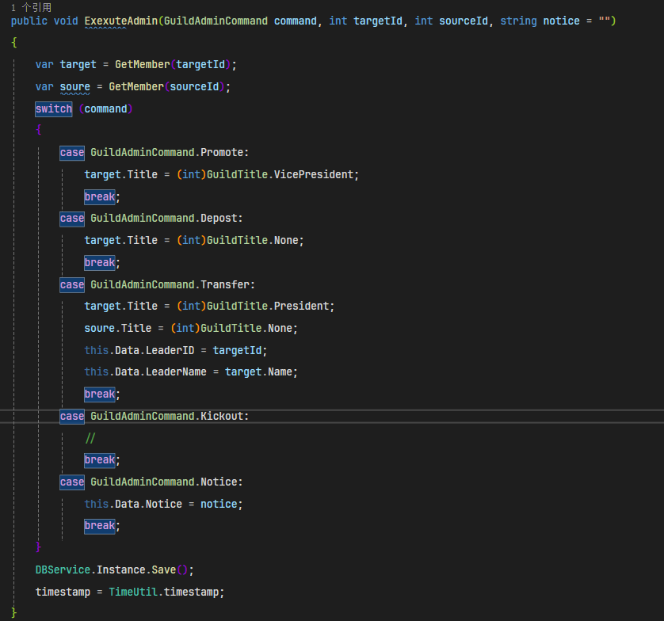
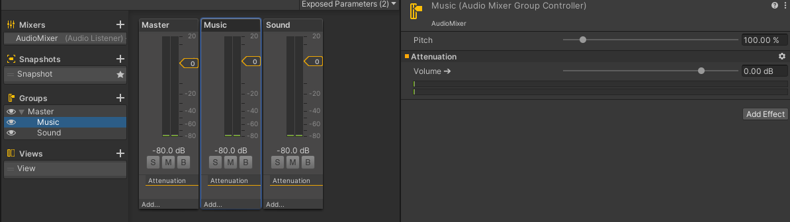

# 业务层

1. # 登录注册系统

    1. 业务需求与当前环境：

        1. 业务需求：

            1. 客户端：玩家输入字符串，检查合理性，发送给服务器。
            2. 服务器：收到玩家的字符串，用EF实体匹配对应数据，进行再校验即可
2. # 移动同步

    1. 业务需求与当前环境：

        1. 业务需求：由于MMORPG的高安全性要求，因此采用状态同步作为同步基底。
        2. 当前环境：服务器缺乏物理引擎与地图数据，无法像真正的状态同步一样全由服务器计算。
    2. 解决方案：

        1. 数据流图：

            

            使用PlayerController提供玩家操作接口，且每次操作更新后，向服务器直接发送状态，而不是传统的发送操作。使用EntityController提供实体控制接口，接收来自网络的状态，并向表现层反应实体状态。
        2. 优势：

            1. 降低开发成本：可以避免状态同步的刚需，即物理引擎与地图数据。用客户端的地图数据，刚体和碰撞体向服务器提供合理的状态。
            2. 降低服务器性能需求：不需要服务器计算玩家的位移。
        3. 劣势：

            1. 安全性堪忧：因为服务器接收的直接是实体状态，并不经过服务器严格运算，因此很难判断是否是作弊。
    3. 移动逻辑优化网络性能：

        1. 当前环境：加入移动同步后，PlayerController会频繁向服务器发送移动同步消息，是目前的消耗大头。
        2. 解决方案：利用关键操作，改造PlayerController和EntityController，使得PlayerC只发送关键状态，Entity根据关键状态自行表现。

            1. 关键操作：引起角色惯性改变的操作都是关键操作，比如从向前到向后，从原地到起跳，从左转向右。
            2. 关键状态：由关键操作产生的新状态。
            3. 优势：

                1. 减少[pps](计算机体系/计算机网络/物理层/bps和pps.md#20250331194520-lm3to3m):能够极大降低发包次数。
            4. 劣势：

                1. 玩家断线后，实体的移动逻辑错乱：因为只接收关键状态且会自行表现，当玩家断线后，会看见实体一直朝某个方向移动。
3. # 物品系统

    1. 业务需求：服务器需要为每个角色维护一套独有的物品
    2. 解决方案：

        1. 数据流图

            

            通过物品管理器统一管理全部物品数据，其他模块若需要数据，则从物品管理器中自行分流出所需部分即可。
        2. 优势：

            1. 简化开发：通过统一的接口获取物品数据，避免每种需求物品的模块都要经过物品解析阶段，加速开发。
            2. 解耦：使得其他需求物品的模块不需要关心物品数据的获取，只需要关心取得数据后完成的业务。
            3. 高可靠性：任意其他模块的数据都引用自物品管理器，当物品管理器的数据改变，其他模块的数据也会自行更改，不会出现纰漏。
4. # 背包系统

    1. 业务需求：

        1. 背包一共两页，一页存储普通物品，一页存储装备。
        2. 每页背包都有格子限制，不到固定等级不解锁。
        3. 背包的物品还拥有各自的堆叠限制，需要物品分批，分批的物品也会占用背包格子。
    2. 解决方案：

        1. 
        2. 采用MVC框架，先从物品管理器中筛选出对应格式的数据，导入BagUI进行显示：

            1. 导出数据时进行数据筛选，筛选出的数据分别存在两个结构体数组中。其中一个数组存储普通物品数据，另一个存储装备数据，分别对应两个背包页需要的两组数据。
            2. 筛选的过程中还需注意堆叠问题，进行物品分批即可。
        3. 优势：

            1. 解耦：MVC框架使得表现与数据相互独立，可相互独立变化。
            2. 简化开发：背包系统没有真正的数据，它的数据全部来自于物品管理器，因此不需要做特殊的维护工作。
    3. 背包系统物品越界问题：

        1. 有没有可能出现刷新错误等逻辑？

            1. 错误物品来源于错误的购入物品与交易物品。只需要从商店系统和任务系统获取物品时加入对背包格子的校验，就可避免错误的数据获取。
5. # 装备系统

    1. 业务需求：

        1. 非当前职业的装备不可显示在UI上。
        2. 非当前等级的装备要设置成灰色。
        3. 已经穿戴的装备要保持住，无论在线离线
    2. 解决方案：

        1. 数据流图：

            
        2. 服务端：

            1. 新增字段：为角色的DB存储新增一个Equips字段，是一共28字节的字节数组。

                1. 本质是一组int数组，标识角色当前穿戴的装备的id，没穿即为0.
                2. 当角色登录时，从数据库读出这28字节，反序列化为int数组保存在NetSession中，并且发回原字节组给客户端。
        3. 客户端：

            1. 序列化：

                1. 接到28字节的数组后，在装备管理器处反序列化为int数组，且根据数据在物品管理器索引Item数据。
                2. 将item数据交给EquipUI，由EquipUI渲染出装备
                3. 属性系统待定。
            2. 反序列化：

                1. 当出现装备穿脱时，首先将装备管理器中的Item[]数据更新，然后将其id信息反序列化为28字节数组，最后向服务器发送装备更新请求。
        4. 优势：

            1. 代价小：不直接存储item数据，存储所有穿戴装备只需要28字节
            2. 双端互通：服务端只需要int数组追踪状态，客户端只需要int数组和配置更新ui。因此不需要将两端的独有数据进行交换，只需要交换配置信息即可。
6. # 好友系统

    1. 代码分析

        1. 数据库如何最简存储好友的相互关系？

            1. 在实现中就是两个角色都存一条对方的好友记录。

                1. 
7. # 组队系统

    1. 业务需求：

        1. UI互动：

            1. 分析

                1. 界面清晰直观
                2. 性能良好

                    1. 遵循UI框架
            2. 解决方案

                1. 在UI框架下进行开发。
        2. 系统间交互：

            1. 分析

                1. 任务系统：

                    1. 可以从任务系统查看组队情况，限制单人不可执行多人任务
                2. 好友系统：

                    1. 可以从好友系统查看某人的组队情况。
                3. 装备系统：

                    1. 可以在组队面板跳转到某人的装备情况。
            2. 解决方案：

                1. 客户端：

                    1. 组队数据可通过TeamManager供外部使用。
                    2. 可伸缩面板在组队面板的权限

                        1. 查看成员装备信息
                        2. 私聊
                        3. 加好友
                2. 服务端：

                    1. 好友系统可发回好友的组队信息。
        3. 消息传输：

            1. 节能：

                1. 组队信息的更新没必要单独发送，而是在后处理机制中一同发送。
            2. 增效：
        4. UI互动：

            1. 入口：好友界面中，可右键好友出现好友信息栏。在信息栏中点击组队选项，发出组队请求。
            2. 组队界面：

                1. 队伍队列：

                    1. 队员Item信息：

                        1. 右键队员Item：

                            1. 如果身份是队员时右键，先判断是否是好友。是好友则显示“查看信息”。不是好友则再添加“添加好友”。
                            2. 如果身份是队长时右键，则重复上述判断，并在最下方添加“移除组队”选项。
                    2. 队长标记：

                        1. 在队长的item旁标记其为队长。
                2. 退出按钮：

                    1. 用于退出当前队伍
    2. 核心：

        1. 网络通讯：

            1. 
            2. 核心：服务器只充当消息转发功能。将双方的角色信息转发，由玩家来决定响应。
            3. 和好友系统的不同：

                1. 好友系统需要截获响应，用于判断是否进行数据库存储。而组队系统不需要，因为所有组队都是临时的。
    3. 代码分析：

        1. 
        2. 流程解析：

            1. 玩家进行组队后，服务器内会为该玩家分配一个Team对象，该team对象提前维护在内存中（参考FreeList），避免反复申请内存。
            2. 随后，该玩家会成为该Team的队长，其他加入的玩家成为Team的队员

                1. 
            3. 最后，会将该Team对象赋给Character的team指针，后续的操作围绕该team对象展开。

                1. 
        3. 服务器和客户端的沟通规范：

            1. 服务器只接收Request请求
            2. 客户端只接收Response响应
        4. 假如一方在组队请求的过程中下线怎么处理？

            1. 在服务器进行检验，在玩家登录时记录其Socket及其信息，就可以根据id等方法校验。
        5. 分层结构的好处？分模块的好处？

            1. 解耦，降低维护时的认知负担
            2. 复用，减少工作量
            3. 功能内聚，降低认知负担。
        6. 如何维护一个组队？

            1. 客户端：

                1. 在客户端的角度，一个组队就是一组队伍数据，包括队员id,队长id
                2. 
                3. 只需从网络更新该队伍数据，即可维护一个组队。
            2. 服务器

                1. 通过TeamManager维护每个character的队伍数据。

                    1. 队伍数据：

                        1. 
                        2. 队伍ID，leader，成员，更新时间戳。
                2. 利用team的对象特性，让处于同一个队伍的character包含同一个team对象。

                    1. 好处：

                        1. 代码精简。
                        2. 方便根据对象的特性完成增删改查等功能。
        7. 如何更新队伍数据才最合适？

            1. 分析：当且仅当队伍数据发生改变时更新最合适。
            2. 实现

                1. 当队伍人员出现变动时，更新时间戳。

                    1. 
                2. 时间戳改变时，在character的后处理中会触发team的后处理。

                    1. 
                    2. 在team的后处理中，将队伍的信息发送出去即可。
8. # 公会系统

    1. 业务需求：

        1. 公会搜索：

            1. UI交互：

                1. 公会面板：

                    1. 初始化

                        1. 每次从数据库取出5个公会加载到面板上。
                    2. 公会搜素：

                        1. 根据玩家输入的公会名称或公会ID返回搜素结果，同时将公会面板清空，只保留搜索结果。
                    3. UI设计

                        1. 保留一定位置给公会信息显示。
                    4. 性能要求：

                        1. 使用异步请求完成加载任务。
            2. 网络通讯：

                1. 
            3. 服务器：

                1. 业务响应：

                    1. 收到公会搜索请求时，检查搜索内容，从数据库中查找是否有符合条件的公会。
                    2. 打包消息成响应，返回搜索结果。
        2. 公会权限：

            1. 业务需求

                1. 会长权限

                    1. 会员权限 + 副会长权限
                    2. 更改公会名称
                    3. 更改公会宣言
                2. 副会长权限

                    1. 会员权限
                    2. 接收入会请求
                    3. 踢人
                    4. 禁言
                3. 会员权限

                    1. 外来人员权限
                    2. 邀请人
                    3. 退会
                4. 外来人员

                    1. 私聊
            2. 结构设计：

                1. 角度一：介于权限是层层累加的，因此可用装饰器模式，用一层层装饰表示权限的累加。

                    1. 如何用装饰器对象表示权限？

                        1. 实施

                            1. 量化权限：用枚举表示权限
                            2. 权限封装：装饰器对象中存储权限数组，每次装饰会往该数组中存储对应枚举值。
                            3. 对外接口：由权限数组提供对外使用权
                        2. 缺点：

                            1. 需要新开数组内存。但还有什么不能新开的呢？
                        3. 优化：

                            1. 用位掩码表示权限

                                1. 缺点：以后新加权限怎么处理？

                                    1. 重新量化权限：用纯二进制数表示权限，这些用于表示权限的二进制数从小到大，互不相同。
                                    2. 权限封装：当装饰到某个权限时，将该权限直接累加到原值上。
                                    3. 对外接口：当外界需要检测该角色存不存在某个权限时，直接用权限对应的掩码进行与运算，得一则有得0则无。
                                2. 缺点：用位掩码表示权限，但日后的维护工作怎么处理？

                                    1. 对外只暴露逻辑：

                                        1. 封装权限的装饰过程：让权限值的累加以及检查权限值是否正确的过程对外不可见。也就是将权限本身作为一个对象构建出来。
                                        2. 权限系统

                                            1. 权限对象：用于存储权限的掩码信息。在初始化公会信息时根据配置表初始化。
                                            2. 权限的打包：
                                            3. 权限的累加或去除：
                            2. 直接转化到用配置表示权限

                                1. 原理：服务器发送身份信息，客户端读配置确定该身份具有什么权限。
                                2. 如何用配置确定该权限具有什么功能？

                                    1. 权限掩码：配置中存储权限掩码，当用配置初始化UI按钮时，在UI按钮处初始化一个权限掩码。当点击该UI按钮，就将该掩码转交给权限分拣器，由分拣器决定进行什么功能（策略模式）。（掩码再进一步变成枚举值得了。）
                                    2. 枚举确认：分拣器中又由工厂模式确定出不同的服务即可。
        3. 成立公会：

            1. 业务需求

                1. 限制：成立公会需要交易50000金，且等级限制在...级
                2. UI交互

                    1. 公会面板处有按钮，点击按钮后客户端先根据配置本地进行检验，如果不满足条件，禁止其创建公会。如果满足条件，向服务器发送公会创建请求。
        4. 加入公会：

            1. 业务需求：

                1. 限制：根据配置，等级一定要达到限制。
            2. UI交互：

                1. 公会面板处，通过公会搜索得到公会条例，在公会条例处右键，即可开启选项面板，选项面板有加入公会，查看公会信息等。也可点击公会条例，进入公会内部查看其成员信息。
    2. 结构分析:

        1. 选项面板：

            1. 业务需求：

                1. 可灵活配置。比如通过配置确定按钮条例的数量，以及每个条例对应的方法。
            2. 结构分析：

                1. 面板：

                    1. 初始化：

                        1. 可读取根据传入的信息初始化按钮条例。
                2. 条例：

                    1. UI交互事件：

                        1. 条例可配置：是否响应右键，是否响应左键。是否响应右键双击，左键双击等。
                        2. 事件可配置：可绑定具体事件。
                    2. 当生成的条例功能不同时，如何灵活注入？  

                        1. 数据来源：配置信息
                        2. 配置信息如何转化成具体服务？比如私聊权限条例，如何通过配置绑定该条例的功能？

                            1. 配置：

                                1. 开启什么服务：通过位掩码的方式决定。
                                2. 具体服务绑定：通过功能码决定。

                                    1. 功能码

                                        1. 配置：功能码来源于配置，也可来源于硬编码。通过在配置中获取功能码，即可决定一个条例匹配的功能是什么。
                                        2. 功能码匹配：当使用某条例的功能时，将该条例的功能码送入匹配中心，由匹配中心返回具体的功能。
            3. 流程总结

                1. 
        2. 公会信息分发更新

            1. 
            2. 利用后处理分发公会信息。
        3. 数据库存储

            1. 公会表
            2. 公会成员表
            3. 公会申请表
    3. 代码分析：

        1. 公会更新的后处理

            1. 

                1. 精髓在于当修改Guild的信息后，Character就能通过时间戳启用Guild的后处理服务，从而给对应客户端发送正确公会信息。且因为Guild可以被多个Character绑定，因此可自动向所有在线character更新公会信息。
                2. 如何对所以Character生效？

                    1. 参考[如何自动发送消息](#20250705152815-e8udkd2)。当GUID的时间戳改变，而character的时间戳未重置，就会自动触发后处理进行公会信息更新。
        2. 如何处理公会权限的灵活匹配？

            1. 在项目里实现

                1. UI交互

                    1. 根据在所处公会中的地位，只显示对应权限的面板。
                    2. 通过隐藏不可见的按钮来限制公会权限。
                2. 网络消息：

                    1. 
                    2. 用枚举定义操作，一个操作一个枚举值。
                    3. 设计原因：这些操作要么对应一个具体的人，要么对应全局。因此不需要很灵活的参数，可以通过传输枚举和成员ID完成命令。

                        1. 
        3. 如何处理公会加入申请？

            1. 申请的数据存储

                1. 在数据库里新增条目，存储未被同意的申请。
            2. 如何在有同意申请权限的公会成员上线时，将该申请发送到它的账户上？

                1. 如何在有权限的成员上线时自动发送消息？

                    1. 如何根据权限定义自动发送的消息？

                        1. 如何自动发送消息

                            1. 时间戳：时间戳保证只要数据库出现更新，立刻将更新完毕的数据返回。
                            2. 数据库：数据库保证数据的持久化。
                            3. 流程图：

                                1. 
                                2. 也就是说，无论当前角色在线还是离线，只要数据库里确实出现更改，时间戳存在变化，那么就通过后处理获取正确的公会信息。
                    2. 如何根据权限区分信息量？

                        1. 
                        2. 在后处理时，会根据角色的身份决定填充对应部分的信息。

                            1. 无角色:只填充公会的基本数据
                            2. 有角色（即角色是公会的成员）：填充其他公会成员的信息
                            3. 会长：填充公会申请。
        4. 流程解析

            1. 
            2. 为什么在Guid中对数据库进行操作？

                1. 面向对象：每个Guid其实都对应了在数据库中的部分数据，它只能操控属于自己的数据。比如Guild永远对GuidID与自己一致的表项进行增删改查。
            3. 劣势：

                1. 无法方便地增加公会的角色信息，也无法方便地更新某个角色永远的角色。

                    1. 原因：

                        1. 将权限和公会角色进行了强绑定，致使要修改权限就必须修改整个角色。
                    2. 解决方案：

                        1. 使用装饰器模式 + 权限掩码表示公会角色。
                        2. 使用策略模式分离权限的业务逻辑和注入渠道。
                        3. 具体方案：[公会权限](#20250630193348-nj294ki)
9. # 聊天系统

    1. 业务需求

        1. 频道划分：

            1. UI交互：

                1. 选择频道：

                    1. 世界
                    2. 好友
                    3. 组队
                2. 聊天显示

                    1. 频道 + 职业 + 用户ID
                3. 用户功能：

                    1. 可右键用户ID进行弹窗，弹窗可选择不同的功能。

                        1. 功能也分权限，如果是好友则会比其他人多更多权限。
                    2. 可左键用户ID进行私聊。
        2. 如何定义频道？

            1. 频道：过滤消息的层级掩码。
            2. 消息：所处层级 + 聊天数据。
        3. 聊天的数据如何存储？

            1. 如何面对巨量的数据？
    2. 最基础的想法

        1. 频道就是不同的聊天页面，其背后就是一个个独立的聊天数据缓冲区，每一个缓冲区就对应数据库中的一块消息。
        2. 数据库：

            1. 持久化：聊天数据存入数据库
            2. 非持久化：不存入数据库
            3. 如何面对巨量的聊天数据？

                1. 无论持久或非持久，都必须考虑该问题。
                2. 方案：

                    1. 时间缓存：对数据打上逾期标签，逾期数据直接删除。
                    2. 范围缓存：按先进先出的队列顺序限制数据量。
        3. 数据缓冲区：

            1. 本质：对数据库的一种虚拟分块。将数据库中的整表划分到一个个缓冲区中，不同的频道读取不同的缓冲区。
            2. 好处：解耦网络数据的输出和数据库，让数据缓冲区作为中间层，降低数据库的压力。
    3. UI自适应

        1. 屏幕自适应
        2. 布局自适应

            1. 主布局组件 + 布局元素

                1. 详情参考：[UGUI源码](UI框架/UGUI源码.md)
                2. 方法：利用布局元素给主布局组件提供布局点，本质是向上递归的过程。从布局元素开始查找上层的主布局组件，根据主布局组件的大小和配置调整自身的大小。

                    - [ ] LayoutElement如何根据主布局组件调整自身？
                    - [ ] Image这种默认LayoutElement如何调整自身？
    4. 代码实现

        1. 如何制作右键弹窗？

            1. 
            2. 启用时，自动将位置调整到鼠标当前位置。
            3. 取消选中，即鼠标点击弹窗外的其他地方时，自动关闭弹窗。
        2. 如何避免聊天输入和移动输入冲突？

            1. 
            2. 当InputField取得交点时，改变输入模式。并在移动控制处判断，如果处于输入文本模式，禁止输入控制角色。
        3. 如何做私聊？

            1. 服务器如何存储如此独立的私聊消息？

                1. 方案

                    1. 不存储私聊消息，参考组队系统，直接将消息通过服务器中转到双方玩家手上。让私聊消息只存储于本地。
                    2. 存储私聊消息，大部分就是后端的神力了。
            2. 如何使用TMP超链接？

                1. 为什么[我]不会触发超链接跳转？

                    1. TMP超链接实现原理：

                        1. 
                        2. 对链接的内容进行解析，将得到的数据（信息发送者的id，name）送入其他模块。
                    2. 链接信息定义

                        1. 可见，【我】信息中并没有可被解析的信息，因此直接跳出除了。
        4. 客户端如何做频道分离？

            1. 频道分离的本质是显示与数据分离。只需要取出不同频道的数据进行显示就是频道分离了。
        5. 服务器如何分频道存储聊天消息？

            1. 服务端如何选择频道？

                1. 
                2. 通过客户端发来的消息中的枚举值选定频道存储区。在本地用List存储聊天信息，不上传数据库。

                    1. 
        6. 服务器如何利用后处理传输消息？

            1. 
            2. 通过在每个Character对象下初始化Chat对象，用Chat对象的后处理发送服务器更新的聊天信息。
            3. 用Idx下标存储每个频道的发送序列号，每次后处理时就发送从上一次发送的序列号到频道当前的序列号。

                1. 
        7. 服务器如何优化因聊天记录过多导致的GC？

            1. 命名堆中的对象何时销毁？是否和普通的对象一致？

                1. 完全一致。
            2. 如何优化Unity的Text组件的字符串GC问题？

                1. 使用TMP的`SetCharArray`操作底层char数据
                2. 使用char对象池缓存字符串数组。

                    - [X] 字符串GC优化

                      

完成时间: 2025-07-09

        8. 流程解析

            1. 
            2. 聊天系统的核心

                1. 数据缓冲池
                2. 数据存储的设计
                3. 字符串GC的性能优化
10. # 骑乘系统

     1. 如何实现骑乘的效果？

         1. 原理：人物和坐骑通过统一的控制器控制动画状态机，而后各自播放各自的动画，通过绑骨完成动作的协调即可。
         2. 什么是动画分层？什么是动画混合？

             1. 同一个动画状态机，但在不同的动画层下，可对应不同的动画。

                 1. 
                 2. Base层的idle动画：
                 3. Ride层的idle动画：
             2. 动画混合

                 1. 不同层的同一个状态下可以混合动画表现，通过权重进行混合。

                     1. 
         3. 如何通过绑骨完成坐骑和人物的模型同步？

             1. 就是设置将角色模型绑定到坐骑的一块骨骼位置上，通过加减一些偏移即可完成模型同步。
         4. 重点：

             1. 核心在于动画分层控制，动画混合。以及通过骨骼位置实现模型与动画同步。
11. # 声音系统

     1. 如何通过ui控制声音的播放？

         1. Slider怎么调整滑动样式？
         2. togger怎么使用开关动画？
         3. 如何制作PlayerPrefs配置文件？
     2. 如何管理音频资源？

         1. 声音系统：

             1. 音源 + 效果 + 混音 + 监听器

                 1. 
         2. 如何控制音量？

             1. 

                 1. 在混音器中可选分组Groups，每组代表着一道混合音轨。
             2. 

                 1. 音源可以选择从哪个音轨输出音效。通过该设置，就可区分不同的声音。比如背景音就是背景音轨，语音就语音的音轨。
             3. 要想设置某个音轨的音量，可以直接用mixer对象调整

                 1. 
                 2. 其中,name是混合音轨暴露出的参数的名字。可以选中音轨在Attenuation中选择暴露参数与否，每个音轨只能暴露一个参数。
         3. 如何切换2d音源效果

             1. 
             2. 直接获取资源并赋值给音源播放。
         4. 3d音源该如何使用

             1. 同理，只是3d音源必须绑定到发出声音的物体处。
12. # 寻路系统

     1. ## 寻路原理：

         1. [寻路建模的三种方式比较 - 知乎](https://zhuanlan.zhihu.com/p/587278064)
         2. 寻路建模：

             1. 作用：将地图模型转化为计算机数据上的一种空间表征，用于后续的寻路算法。
             2. 例子：navmesh,grid都是寻路建模的方法，而不是寻路建模的算法。在建模完成后，都可以用a*算法进行寻路。

                 1. 
                 2. 格子：将空间划分为可达与不可达两种格子，可达格子用于当寻路点，而不可达作为障碍点。
                 3. 路点：通过手动放置寻路点建模
                 4. 导航网格：将地形转化为三维空间下的三角形，以顶点 + 顶点索引的方式存储空间数据。等同于重新对地图进行建模。
     2. 如何选中寻路方案

         1. 任何寻路方案都取决于地图的寻路建模

             1. 网格建模

                 1. grid

                     1. 优点：建模速度奇快
                     2. 缺点：

                         1. 要寻路精度就必须牺牲空间存储，要存储就必须牺牲寻路精度。
                         2. 必须在寻路过程中做平滑，因为网格建模会出现90度转弯的问题。
                         3. 没有三维数据
             2. 多维建模

                 1. waypoint

                     1. 优点：自定义程度高
                     2. 缺点：

                         1. 耗人力，人力越重精度越高。
                         2. 灵活度差
                 2. NavMesh

                     1. 优点：寻路建模较为精确
                     2. 缺点：

                         1. 建模时间长。
     3. NavMesh

         1. NavMesh的原理

             1. [项目首页 - recastnavigation:Navigation-mesh Toolset for Games - GitCode](https://gitcode.com/gh_mirrors/re/recastnavigation/?utm_source=artical_gitcode&amp;index=top&amp;type=card&amp;&amp;isLogin=1)
             2. NavMesh的建模算法

                 1. [[游戏开发] Recast Navmesh源码剖析 - 01 导论 - 概览_哔哩哔哩_bilibili](https://www.bilibili.com/video/BV11d4y117Au/?spm_id_from=333.337.search-card.all.click&vd_source=91f9deb48611218169c3b6e46be39444)
         2. 客户端如何寻路？

             1. 如何设置NavMesh？

                 1. Navigation

                     1. Agent面板

                         1. 

                             1. 作用：用于设置Agent的各属性

                                 1. radius和Height：用于设置Agent面对障碍物时的不同反应，当太高就无法通过过矮的通道。
                                 2. Step Height：用于设置Agent可直接迈过的台阶高度。
                                 3. Drop Height：假如烘焙路径中存在断层，该断层距离当前位置多高能跨过去。
                                 4. Jump Distance:假如烘焙路径中存在断层，该断层距离当前位置多远能跨过去。
                     2. Areas面板

                         1. 
                         2. 作用：用于设置Surface的各类型，Cost即寻路优先度。
                 2. NavMesh Surface

                     1. 
                     2. AgentType：烘焙出的寻路数据给哪一类Agent使用
                     3. Default Area: 烘焙出的数据的优先级
                     4. Generate Links ：烘焙出的地形具有可跨越性，可跨域的长度取决于Agent设置的Drop Height,Jump Distance.
                     5. Use Geometry : 根据收集的物体的什么模型进行寻路建模，网格或者碰撞盒。
                     6. Object Collection：

                         1. Collect Objects:

                             1. 
                             2. AGO : 所有物体都会被寻路建模
                             3. Volume：只在指定包围盒内进行寻路建模
                             4. Current Object hierachy：对绑定了Surface组件的物体下的子物体进行建模。
                             5. NavMeshModifier：对绑定了NavMeshModifier的物体进行建模。
                 3. NavMesh Agent

                     1. 
                     2. 调整寻路的基本速度。
             2. 如何将navMesh的寻路结果上传到服务器上？

                 1. 角色的寻路移动分客户端和服务端两部分

                     1. 客户端：直接让NavMesh寻路修改本地transform坐标
                     2. 服务端：接收客户端发来的位移状态消息，如前进与旋转，在服务端再次运算移动。只需要保证寻路速度和服务器上角色速度一致，即可实现双端同步。
             3. 如何控制哪些地方是不可达的？

                 1. 使用NavSurface的烘焙选项自主控制。
                 2. 使用NavObstacle

                     1. 
                     2. 作用：对于挂载了NavObstacle的物体，Agent会在寻路中判断其为碰撞体。Agent无法穿过它，也无法寻路到它的中心。看起来就是一个寻路过程中的障碍。但此时它依然是可寻路的，只是无法通过。
                     3. carve属性：NavObstacle的carve属性开启时，会将当前网格挖出一个洞来，彻底破坏寻路。但当关闭时网格又会恢复。
         3. 服务端如何寻路？

             1. 服务端如何对地图进行建模？

                 1. 先在客户端用NavMesh进行寻路建模，再对客户端的建模数据进行采样，将采样结构上传至服务端即可。
         4. 如何动态烘焙寻路网格

             1. 
             2. RemoveData : 删除当前烘焙的寻路数据
             3. ADDdATA:根据配置重新烘焙数据。
     4. 任务目标追踪实现

         1. NavMesh结合A*算法实现任务目标的寻路

             1. 本质上就是一个SetDestination就行。其他的都是一些修正。
